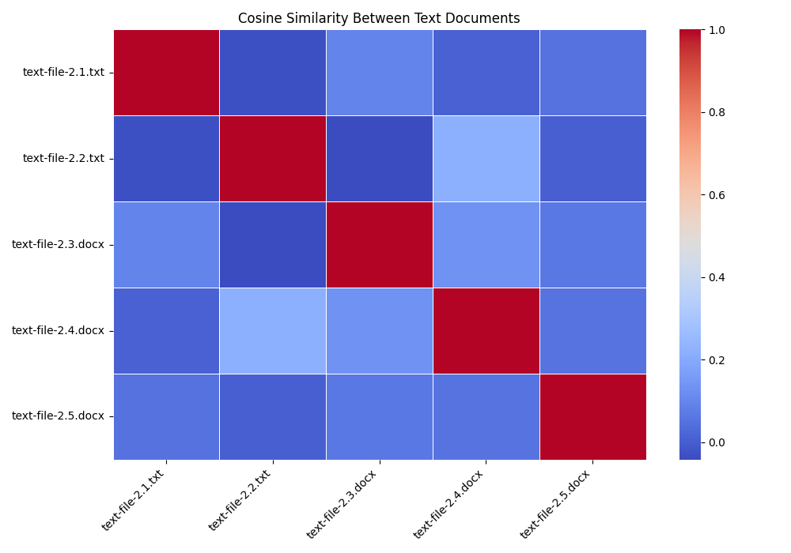
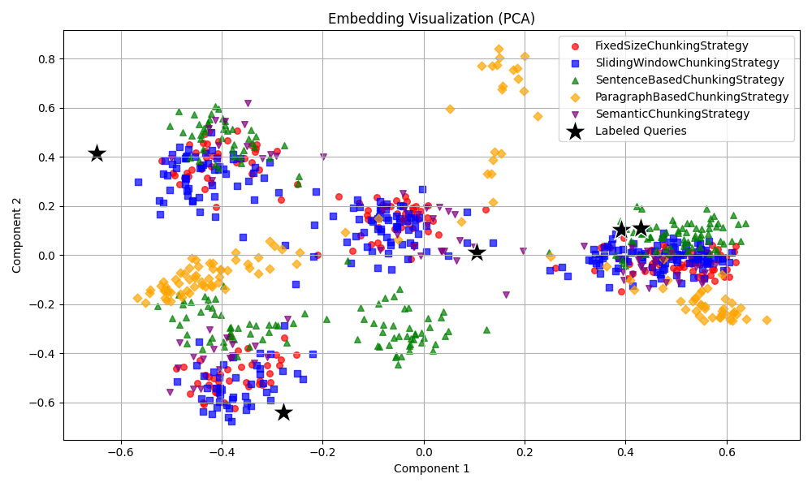

# Embedding & Document Similarity Analysis

This report summarizes two key visual analyses from the RAG pipeline:
1. **Cosine Similarity Heatmap** of full document embeddings
2. **PCA Embedding Visualization** of chunking strategies with overlaid labeled queries

---

## 1. Cosine Similarity Heatmap

### Insights:

- As expected, each document is most similar to itself (diagonal = 1.0).

- `text-file-2.1.txt` and `text-file-2.2.txt` have **low similarity**, indicating they cover very different topics.

- `text-file-2.3.docx` and `text-file-2.4.docx` show **moderate similarity**, suggesting some thematic overlap — possibly similar use cases or domains.

- `text-file-2.5.docx` has **low similarity with all others**, highlighting it might contain unique or unrelated content.

---

## 2. PCA Embeddings Visualization

### Insights:

- Labeled queries (black ★ stars) cluster mostly near the **right-hand cluster**

- `ParagraphBasedChunkingStrategy` creates **distinctly spaced clusters**, reflecting its longer, more content-heavy chunks.

- `MarkdownHeaderChunkingStrategy` has few, sparsely distributed embeddings, as expected due to its low chunk count.

---