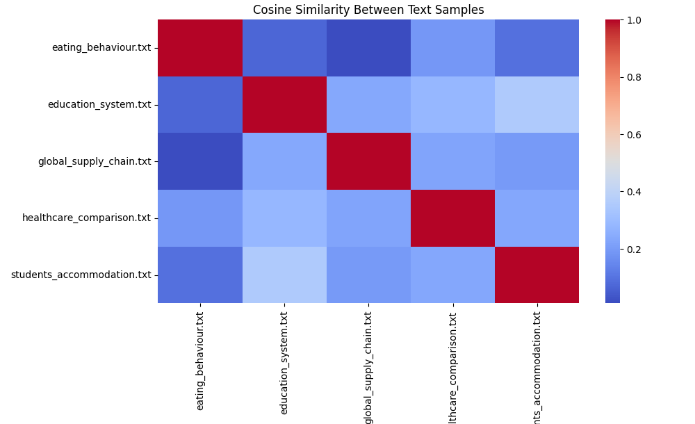
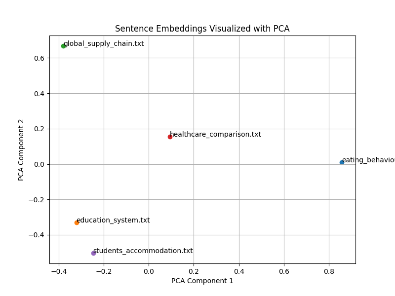
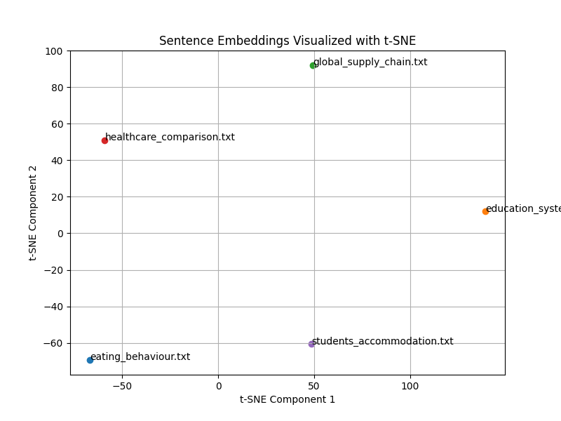

# Embedding Visualization

## Index
- [Embedding Visualization](#embedding-visualization)
  - [Index](#index)
  - [1. Cosine Similarity Heatmap](#1-cosine-similarity-heatmap)
    - [Insights:](#insights)
  - [2. PCA Embeddings Visualization](#2-pca-embeddings-visualization)
    - [Insights:](#insights-1)
  - [3. t-SNE Embeddings Visualization](#3-t-sne-embeddings-visualization)
    - [Insights:](#insights-2)

## 1. Cosine Similarity Heatmap

### Insights:

- Each document is most similar to itself (diagonal = 1.0, as expected).

- `education_system.txt` and `students_accommodation.txt` have relatively higher similarity (~0.5), suggesting they might share related themes (e.g., student life, institutional settings).

- `global_supply_chain.txt` has low similarity with most other documents, indicating it’s semantically distinct from the rest.

- `healthcare_comparison.txt` has moderate similarity with several documents, possibly reflecting general themes (like services or policy comparison).

## 2. PCA Embeddings Visualization 

### Insights:

- `eating_behaviour.txt` is distinctly separated from the cluster, showing it’s semantically different.

- `education_system.txt`, `students_accommodation.txt`, and `healthcare_comparison.txt` are relatively closer, suggesting partial topic overlap.

- `global_supply_chain.txt` stands alone in a different direction—consistent with its low similarity in the heatmap.

## 3. t-SNE Embeddings Visualization

### Insights:

- `education_system.txt` and `students_accommodation.txt` are somewhat clustered, again implying shared thematic content.

- `global_supply_chain.txt` is far apart from other points—highlighting its uniqueness in the dataset.

- `eating_behaviour.txt` and `healthcare_comparison.txt` are positioned in their own regions, showing medium uniqueness.
